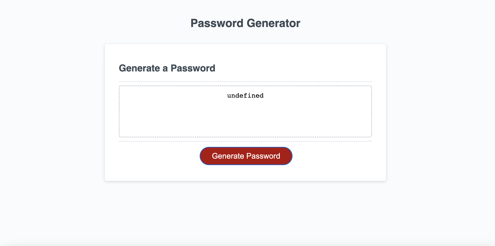
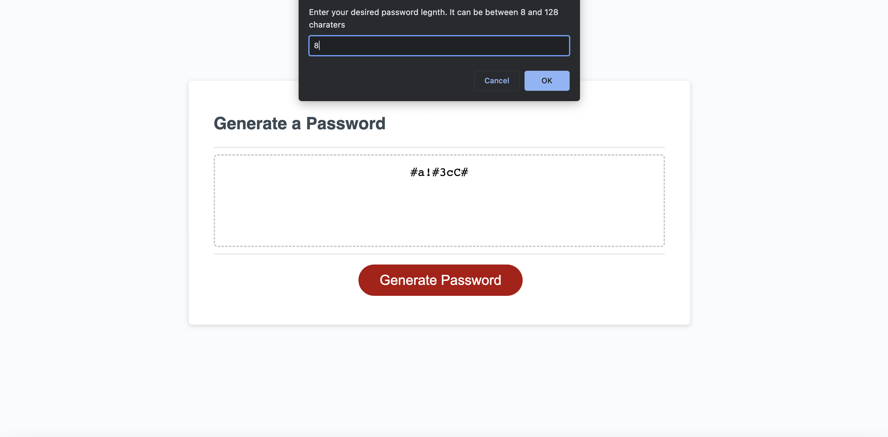

# give-me-a-password-now

## Description

### What was our motivation?

- I have been hired to modify starter code and create an application that enables employees to generate random passwords based on criteria that they’ve selected. This app will run in the browser and will feature dynamically updated HTML and CSS powered by JavaScript code that I have written. It will have a clean and polished, responsive user interface that adapts to multiple screen sizes.

### Why did we build this project?

- I built this project to showcase my ability to use codittional logic with javascript. Using conditional statements to build a password generator wa a great opportunity to be creative in how we approached the job and met requirements.

### What did we learn? 

- In this project I learned how to do some of the following: 
    - assign variables
    - use the window.confirm method that returns a boolean indicating OK (true) or Cancel (false)
    - use the window.alert method
    - use the Logical AND operator for a set of of boolean operands
    - use the .concat method to return a new array by  merging 2 or more arrays
    - use the Conditional Statements "if and else"
    - use for statements to create loops
    
 
## User Story

```
AS AN employee with access to sensitive data
I WANT to randomly generate a password that meets certain criteria
SO THAT I can create a strong password that provides greater security
```

## Acceptance Criteria

```
GIVEN I need a new, secure password
WHEN I click the button to generate a password
THEN I am presented with a series of prompts for password criteria
WHEN prompted for password criteria
THEN I select which criteria to include in the password
WHEN prompted for the length of the password
THEN I choose a length of at least 8 characters and no more than 128 characters
WHEN asked for character types to include in the password
THEN I confirm whether or not to include lowercase, uppercase, numeric, and/or special characters
WHEN I answer each prompt
THEN my input should be validated and at least one character type should be selected
WHEN all prompts are answered
THEN a password is generated that matches the selected criteria
WHEN the password is generated
THEN the password is either displayed in an alert or written to the page
```

## Mock-Up

The following shows a sample of the web application's appearance:





## Deployment 

Deployed application can be found at https://loyallhart.github.io/give-me-a-password-now/
